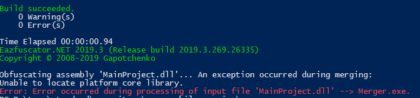

# Error while obfuscating assembly targeting .NET Standard 2.0

Error screenshot: 

To reproduce:
1. Make sure `msbuild.exe` and `Eazfuscator.NET.exe` are in the path
2. Run `build.ps1` from PowerShell